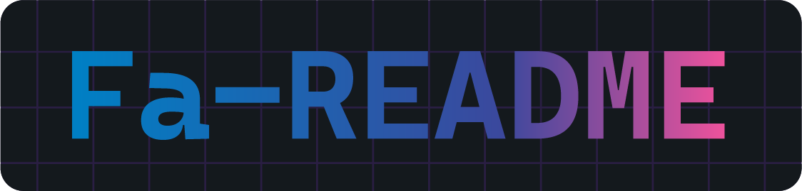

A growing collection of creative **HTML**, **CSS**, and **JavaScript** mini‑projects, all sharing a common core for easy management and contribution.

----------

## 🚀 About This Repository

This repo is a playground for experimenting, learning, and building small but useful web components and effects. It’s perfect for:

-   Practicing and showcasing frontend skills
-   Creating reusable small UI elements
-   Collaborating with the open‑source community

New projects will be added regularly — and you can help shape them!

----------

## 📂 Structure

complete soon👨‍💻

## 🛠 Installation & Usage

1.  **Clone** the repository:

`git clone https://github.com/AshkanAmjadi/mini-projects.git`

-   **VS Code Extension (Live Server)** → Right‑click `index.html` → _Open with Live Server_
-   **npm http-server**:
    
    `npm install -g http-server
    http-server .` 
    
-   **Python** (v3):
    
    `python -m http.server 5500`

## 🤝 Contributing

We welcome contributions of all sizes!

1.  Fork this repository
2.  Create a new branch for your feature/fix
3.  Add your mini project inside its own folder
4.  Open a Pull Request and describe your changes

💡 Ideas: animations, effects, small games, components, coding experiments.

## 🌟 How You Can Help

-   Add a new unique mini project
-   Improve existing code or design
-   Report bugs and suggest features via [Issues](../../issues)
-   Spread the word to other developers

----------

**Let’s make something awesome — one mini project at a time!**

----------

Toggle me!
Peek a boo!
